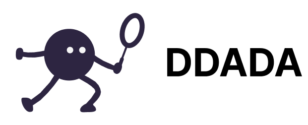
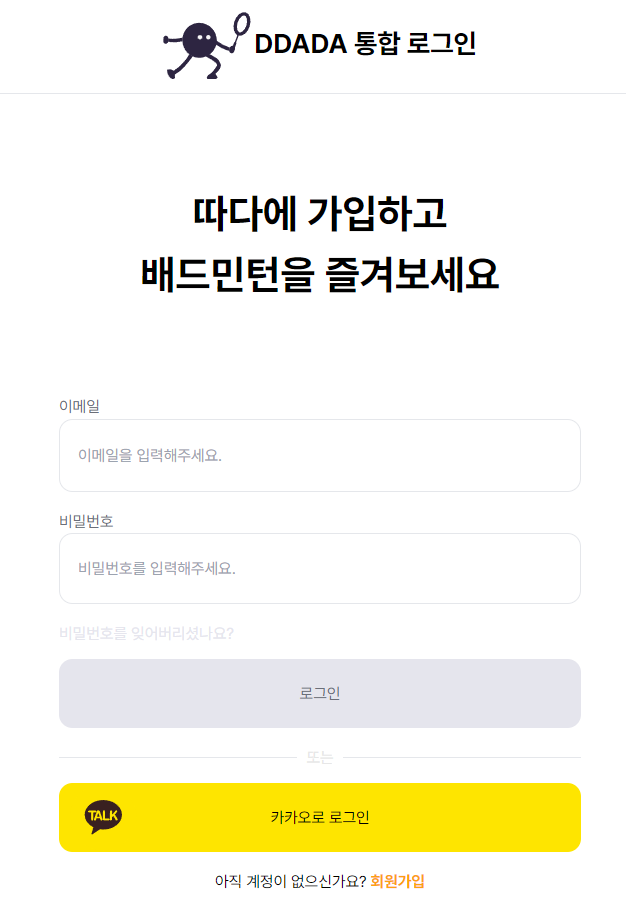
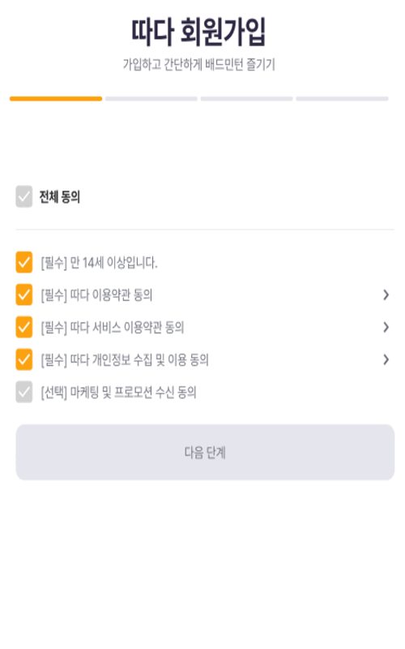
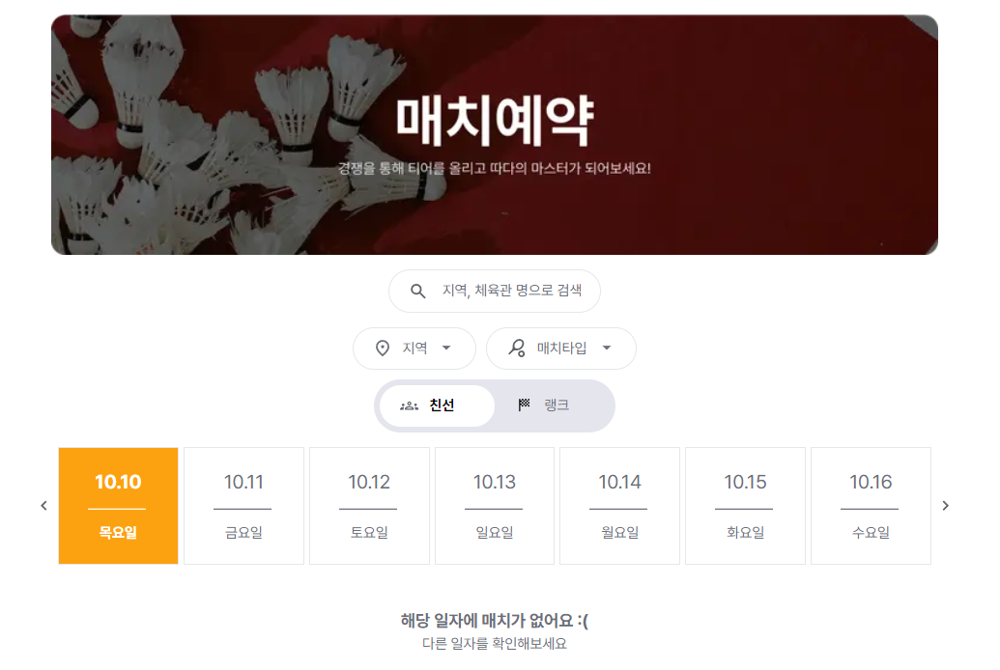
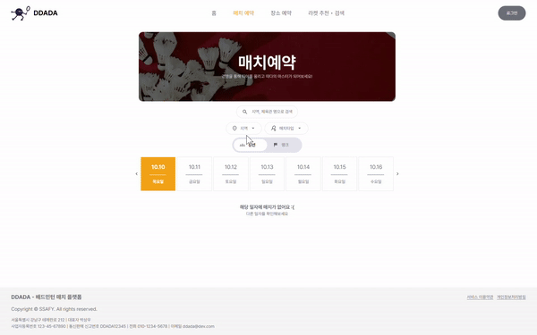
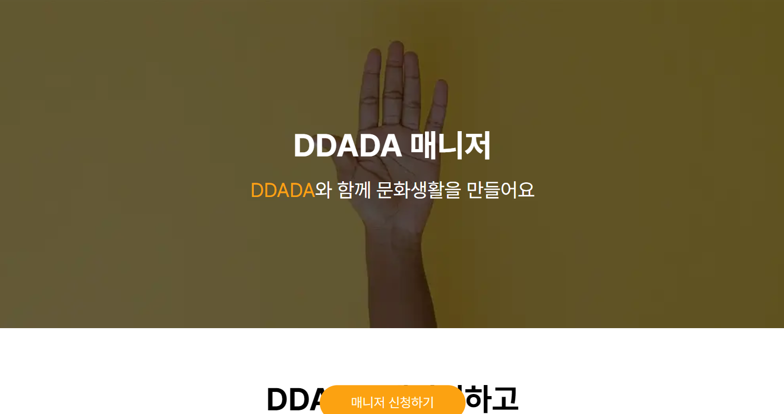
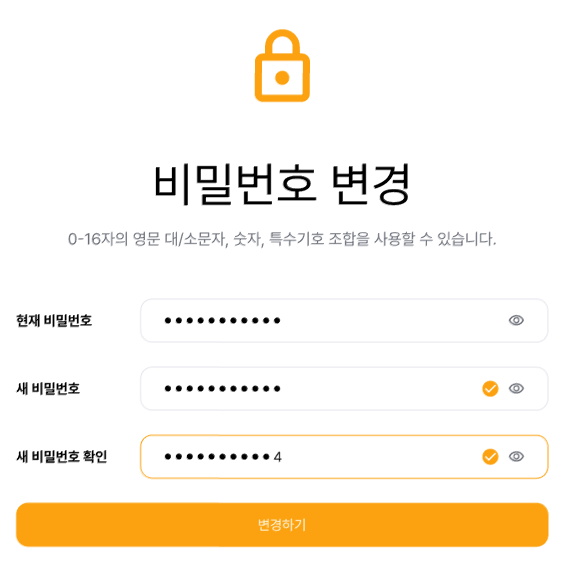

# 따다 프론트



- 배포 URL : https://ddada.xyz

## 📅 **프로젝트 기간**

- 2024.08.19 ~ 2024.10.11

## 🙇🏻‍♂️ **팀원소개**

<div align="center">
  
| [박상우](https://github.com/coolfin) | [전태호](https://github.com/Taehororo) | [최홍석](https://github.com/k-redstone) |
| :----------------------------------: | :-----------------------------------: | :-----------------------------------: | 
||||
|          FE, DESIGN          |                  FE                  |              FE, INFRA              |

</div>

## 🧑🏻‍💻 개발 관련 기술

### 📋 git 이슈/브랜치 관리

### issue

- 프론트엔드와 백엔드, 데이터는 `label`로 분류한다.
- `assignees`는 이슈 생성자가 스스로 할당한다.
- 이슈 타입

  ```markdown
  FEAT : 새로운 기능 추가
  FIX : 버그 수정
  HOTFIX : 치명적인 버그 급하게 수정
  CHORE : (코드 수정 없는) 설정 변경
  DOCS : 문서 생성 및 수정
  DESIGN : 레이아웃 구현 및 디자인 수정
  REFACTOR : 리팩토링
  REMOVE : 파일/코드 삭제
  MERGE : 브랜치 병합
  ```

- 작성 예시
  **[타입] 이슈 명**
  - [FEAT] PWA 구현
  - [DESIGN] 랜딩 페이지 레이아웃 디자인

### branch

- 프론트엔드, 백엔드, 데이터는 접두사로 **`fe/ be/ data/`** 를 붙인다.
- 브랜치 생성 시, 영문은 모두 **소문자**를 사용한다.
- git flow 방식을 채용하여 dev branch로 protect한다.
- 완료 된 작업에 대하여 PR 완료 이후 해당 작업 브랜치는 삭제한다.
- 생성 예시
  **분야/타입/#이슈번호\_이슈명**
  - fe/feat/i1_pwa
  - fe/design/i2_landing

### commit

- 영문은 모두 **소문자**를 사용한다.
- 한글도 가능하다.
- 생성 예시
  - docs: TIL 생성
  - feat: PWA setting

### merge

- 영문은 모두 소**문자**를 사용한다.
- 내용은 템플릿을 사용한다.
- 생성 예시
  **분야/타입/#이슈번호 기능명 | 간단한 설명**
  - be/feat/i1_backend cicd
  - fe/design/i2\_랜딩페이지

### 🐬 **개발 기술**

**React**

- 컴포넌트화된 구조로 유지보수와 재사용성을 고려해 개발했습니다.
- 재사용되는 UI 요소(예: 헤더, 푸터, 배너 등)를 컴포넌트로 만들어 리소스를 절약하고 코드 중복을 최소화했습니다.

**Next.js**

- 서버 사이드 렌더링과 정적 사이트 생성(SSG)을 지원하여 SEO 향상과 초기 로딩 속도 개선에 기여했습니다.
- 페이지 기반 라우팅을 통해 파일 구조만으로 라우팅이 자동으로 설정되어 개발 효율성을 높였습니다.
- 내장된 API Routes를 활용하여 백엔드와의 통합을 간소화했습니다.

**React Query**

- 서버 상태 관리에 React Query를 사용하여 데이터의 캐싱, 동기화, 업데이트를 효율적으로 처리했습니다.
- 데이터를 fetching하는 동안 로딩 상태와 오류를 자동으로 관리해 UI의 안정성을 높였습니다.
- 서버에서 받은 데이터를 캐싱해 재요청을 최소화하여 성능을 개선했습니다.

**Tailwind CSS**

- 유틸리티 클래스 기반 스타일링을 통해 빠르고 간결하게 스타일을 적용했습니다.
- 필요 시 커스텀 테마를 적용해 일관된 UI 스타일을 유지했습니다.
- CSS-in-JS 라이브러리 대신 Tailwind CSS를 사용하여 성능을 최적화하고 유지 보수를 단순화했습니다.

**ESLint와 Prettier**

- 코드 품질 관리는 ESLint로, 코드 포맷팅은 Prettier로 처리하여 코드의 일관성과 가독성을 높였습니다.
- Airbnb 스타일 가이드를 참고해 규칙을 설정했고, 팀원들과 협의해 예외 규칙을 조정했습니다.
- 협업 시 코드 스타일을 일관되게 유지함으로써 개발 속도를 높였습니다.

### 👩🏻‍🔧 **기술 스택**

<div align="left">
  
  #### 🚀 프레임워크 및 라이브러리
  
  
   
  
  #### 📊 상태 관리
   
  
  
  #### 📡 데이터 요청
  
  
  #### 💄 스타일링
   
  
  
  #### 🔧 코드 품질 관리
  
  

</div>

## 프로젝트 구조

```
📦src
┣ 📂api
┣ 📂app
┃ ┣ 📂(auth)
┃ ┃ ┣ 📂login
┃ ┃ ┣ 📂reset-password
┃ ┃ ┗ 📂signup
┃ ┣ 📂(main)
┃ ┃ ┣ 📂court-reservation
┃ ┃ ┣ 📂manager-recruit
┃ ┃ ┣ 📂match-reservation
┃ ┃ ┃ ┣ 📂detail
┃ ┃ ┃ ┃ ┗ 📂[matchId]
┃ ┃ ┣ 📂mypage
┃ ┃ ┃ ┣ 📂mymatch
┃ ┃ ┃ ┃ ┣ 📂[matchId]
┃ ┃ ┃ ┣ 📂password-change
┃ ┃ ┃ ┣ 📂playstyle
┃ ┃ ┃ ┣ 📂profile-edit
┃ ┃ ┣ 📂ranking
┃ ┣ 📂(manager)
┃ ┃ ┣ 📂manager
┃ ┃ ┃ ┣ 📂detail
┃ ┃ ┃ ┃ ┗ 📂[gameId]
┃ ┃ ┃ ┣ 📂done
┃ ┃ ┃ ┃ ┗ 📂[gameId]
┃ ┃ ┃ ┣ 📂match
┃ ┃ ┃ ┃ ┗ 📂[gameId]
┃ ┣ 📂dashboard
┃ ┣ 📂racket
┃ ┃ ┣ 📂recommend
┣ 📂components
┃ ┣ 📂CommonModal
┃ ┣ 📂landing
┃ ┣ 📂MainFooter
┃ ┣ 📂MainHeader
┃ ┣ 📂MatchCourtInfo
┃ ┣ 📂MatchRule
┃ ┣ 📂MatchTypeTag
┃ ┗ 📂UserTierWithIcon
┣ 📂constants
┃ ┣ 📂day
┣ 📂features
┃ ┣ 📂auth
┃ ┣ 📂court-reservation
┃ ┣ 📂gym
┃ ┣ 📂landing
┃ ┣ 📂manager
┃ ┃ ┣ 📂api
┃ ┃ ┣ 📂components
┃ ┃ ┣ 📂constants
┃ ┃ ┣ 📂hooks
┃ ┃ ┣ 📂stores
┃ ┃ ┣ 📂types
┃ ┃ ┗ 📂utils
┃ ┣ 📂match-reservation
┃ ┣ 📂mypage
┃ ┣ 📂racketRecommend
┃ ┣ 📂ranking
┃ ┗ 📂reservationDetail
┣ 📂hooks
┣ 📂providers
┣ 📂static
┃ ┣ 📂fonts
┃ ┗ 📂imgs
┗ 📂types
┃ ┗ 📂user
```

## 역할 분담

### 🍊박상우

- **UI**
  - 페이지 : 전체 와이어프레인 설계 및 전체 디자인
  - 페이지에 대한 세부 디자인 수정

<br>
    
### 👻전태호

- **UI**
  - 페이지 : 로그인, 회원가입, 마이페이지, 장소 예약, 매치 예약, 매니저 모집 페이지, 랜딩 페이지, 랭킹 페이지
  - 공통 컴포넌트 : 푸터, 포트윈 결제 모달
- **기능**
  - 프로필 설정 및 수정 페이지 유저 아이디 유효성 및 중복 검사, 장소 예약, 매치 예약, 비밀번호 찾기 기능, 이메일 인증, 핸드폰 인증, 매치 분석 상세 , 플레이스타일 분석 기능

<br>

### 😎최홍석

- **UI**
  - 페이지 : 매니저 경기 관리 페이지, 매니저 점수 입력 페이지, 매치 예약 상세 페이지, 체육관 제휴 페이지, 라켓 추천 페이지
  - 공통 컴포넌트 : 메인 헤더, 모달
- **기능**
  - 매니저가 배드민턴 점수를 사용자들에게 입력하는 기능, 배트민턴 라켓 추천 기능, 신고 기능, 체육관 관리자의 돈 인출 기능

## 📖 **페이지별 기능**

### 1. Auth

<details>
<summary>로그인 화면</summary>  

</details>
<details>
<summary>회원가입</summary>  

</details>

### 2. 일반 유저

<details>
<summary>랜딩 페이지</summary>

</details>

<details>
<summary>매치 예약 페이지</summary>
<h3>[매치가 없을 때]</h3>

<h3>[매치가 있을 때]</h3>

<h3>[시연]</h3>

</details>

<details>
<summary>장소 예약 페이지</summary>

</details>

<details>
<summary>라켓 추천 • 검색 페이지</summary>

</details>

<details>
<summary>랭킹</summary>

</details>

<details>
<summary>매니저 모집 페이지</summary>
<p>매니저 신청하기 버튼 클릭시 구글 폼으로 이동합니다.</p>

</details>

<details>
<summary>체육관 제휴 페이지</summary>
<p>체육관 제휴맺기 클릭 시 카카오 오픈채팅으로 연결됩니다.</p>

</details>

<details>
<summary>마이 페이지</summary>
  <details style="margin-left: 20px">
    <summary>내 프로필 수정</summary>
    
  </details>
  <details style="margin-left: 20px">
    <summary>비밀번호 변경</summary>
    
  </details>
  <details style="margin-left: 20px">
    <summary>나의 매치</summary>
  </details>
   <details style="margin-left: 20px">
    <summary>플레이스타일 분석</summary>
  </details>
</details>

### 3. 매니저

<details>
<summary>매치 상세 페이지</summary>
</details>

<details>
<summary>매치 완료 페이지</summary>
</details>

<details>
<summary>매치 진행 페이지</summary>
</details>

### 4. 체육관 관리자

<details>
<summary>대시보드 페이지</summary> 
</details>

## ⚒️ **프로젝트 후기**

### 🍊박상우

<br>
    
### 👻전태호
많은 것을 배울 수 있는 프로젝트였습니다. 곁에 든든한 프론트 팀원이 있다는게 정말 큰 힘이 되었습니다. 오직 개발에만 집중할 수 있도록 배려해준 팀원 덕분에 프론트 개발에서 제가 할 수 있는 최대한을 보여줄 수 있었던 것 같습니다.
이렇게 제대로 된 분업이 프로젝트는 처음이라 이 경험을 양식 삼아 더욱 성장해나가겠습니다.

<br>

### 😎최홍석
