# SSAFY A509 DDADA


- 배포 URL : https://ddada.xyz

## 📅 **프로젝트 기간**

- 2024.08.19 ~ 2024.10.11

## 🙇🏻‍♂️ **팀원소개**

<div align="center">
  
| [박상우](https://github.com/coolfin) | [전태호](https://github.com/Taehororo) | [최홍석](https://github.com/k-redstone) | [정한수](https://github.com/Jung-hansu) | [최성철](https://github.com/CSchoice) |[윤경서](https://github.com/yoonkyungseo) |
| :----------------------------------: | :-----------------------------------: | :-----------------------------------: | :-----------------------------------: | :-----------------------------------: | :-----------------------------------: | 
|||||||
|          FE, DESIGN          |                  FE                  |              FE, INFRA              |              BE, INFRA              |              BE            |              DATA              |

</div>

## 🧑🏻‍💻 개발 관련 기술

### 📋 git 이슈/브랜치 관리

### issue

- 프론트엔드와 백엔드, 데이터는 `label`로 분류한다.
- `assignees`는 이슈 생성자가 스스로 할당한다.
- 이슈 타입

  ```markdown
  FEAT : 새로운 기능 추가
  FIX : 버그 수정
  HOTFIX : 치명적인 버그 급하게 수정
  CHORE : (코드 수정 없는) 설정 변경
  DOCS : 문서 생성 및 수정
  DESIGN : 레이아웃 구현 및 디자인 수정
  REFACTOR : 리팩토링
  REMOVE : 파일/코드 삭제
  MERGE : 브랜치 병합
  ```

- 작성 예시
  **[타입] 이슈 명**
  - [FEAT] PWA 구현
  - [DESIGN] 랜딩 페이지 레이아웃 디자인

### branch

- 프론트엔드, 백엔드, 데이터는 접두사로 **`fe/ be/ data/`** 를 붙인다.
- 브랜치 생성 시, 영문은 모두 **소문자**를 사용한다.
- git flow 방식을 채용하여 dev branch로 protect한다.
- 완료 된 작업에 대하여 PR 완료 이후 해당 작업 브랜치는 삭제한다.
- 생성 예시
  **분야/타입/#이슈번호\_이슈명**
  - fe/feat/i1_pwa
  - fe/design/i2_landing

### commit

- 영문은 모두 **소문자**를 사용한다.
- 한글도 가능하다.
- 생성 예시
  - docs: TIL 생성
  - feat: PWA setting

### merge

- 영문은 모두 **소문자**를 사용한다.
- 내용은 템플릿을 사용한다.
- 생성 예시
  **분야/타입/#이슈번호 기능명 | 간단한 설명**
  - be/feat/i1_backend cicd
  - fe/design/i2\_랜딩페이지

### 👩🏻‍🔧 **기술 스택**

<div align="left">

### FE

---

#### 🚀 프레임워크 및 라이브러리

  
  
   
  
  #### 📊 상태 관리
   
  
  
  #### 📡 데이터 요청
  
  
  #### 💄 스타일링
   
  
  
  #### 🔧 코드 품질 관리
  
  

### BE

---

#### 🚀 프레임워크 및 라이브러리

 
 


#### 📂 DB 및 스토리지

 
 
 


#### 🎁 API

 


### DATA

---


### INFRA

---

#### 🔗 CI/CD

 
 


#### 💻 모니터링

 


## 역할 분담

### 🍊박상우

- **기획**
  - JIRA 번다운차트, 스프린트 관리
  - UT(Usability Test) 가이드 제작
  - QA(Quality Assuarance) 가이드 제작
  - gitlab, frontend 코드 컨벤션 제작
- **DESIGN**
  - FIGMA 전체 와이어프레인 설계 및 전체 페이지 디자인
  - TailwindCSS 디자인가이드 제공
  - 컴포넌트 세부 디자인 코드 수정

<br>
    
### 👻전태호

- **UI**
  - 페이지 : 로그인, 회원가입, 마이페이지, 장소 예약, 매치 예약, 매니저 모집 페이지, 랜딩 페이지, 랭킹 페이지
  - 공통 컴포넌트 : 푸터, 포트윈 결제 모달
- **기능**
  - 프로필 설정 및 수정 페이지 유저 아이디 유효성 및 중복 검사, 장소 예약, 매치 예약, 비밀번호 찾기 기능, 이메일 인증, 핸드폰 인증, 매치 분석 상세 , 플레이스타일 분석 기능

<br>

### 😎최홍석

- **UI**
  - 페이지 : 매니저 경기 관리 페이지, 매니저 점수 입력 페이지, 매치 예약 상세 페이지, 체육관 제휴 페이지, 라켓 추천 페이지
  - 공통 컴포넌트 : 메인 헤더, 모달
- **기능**
  - 매니저가 배드민턴 점수를 사용자들에게 입력하는 기능, 배트민턴 라켓 추천 기능, 신고 기능, 체육관 관리자의 돈 인출 기능

### 🐱‍🏍정한수

- **BE**

  - 매치 관리 : 체육관, 코트, 매치, 점수 데이터 설계 및 API 관리
  - 매니저, 체육관 관리자 관리 : 매니저 및 체육관 관리자 로직 관리
  - 라켓 관리 : ES를 이용한 검색 기능

- **INFRA**
  - 서버 관리 : 백엔드 dev/prod 서버 관리
  - CI/CD 관리 : Docker를 사용해 Jenkins 파이프라인 관리
  - DB 인스턴스 관리 : PostgreSQL, Elasticsearch, Redis Cluster 구축
  - 모니터링 : Prometheus, Grafana를 통한 모니터링

<br>

### 🏓최성철

- **BE**
  - 유저관리 : 플레이어 회원관리, 플레이어 프로필, 플레이어 분석 데이터 조회
  - 인증 : 유저 인증 시스템
  - 데이터 : 데이터 파트와 API 연결

<br>

### 🎯윤경서

- **DATA**
  - 데이터 수집 및 전처리: 배드민턴 경기 데이터 라벨링 & 배드민턴 라켓 데이터 크롤링, 각 데이터 전처리 진행
  - 통계 분석: Shapiro-Wilk 검정으로 데이터 정규성 검정 및 통계분석 진행, EDA를 통한 배드민턴 분석 항목 선정 및 각 항목별 통계 지표 설정
- **프롬프트 엔지니어링**
  - GCP의 Vertex AI 기능을 활용하여 Gemini 프롬프트 엔지니어링 진행
  - 선수의 분석 항목별 점수를 제공하여 해당 점수 조합에 따라 개인별 경기 성향 제공 및 성향에 따라 앞으로의 발전을 위한 방향성 추천


<br>

## 📖 **페이지별 기능**

### 1. Auth

<details>
<summary>로그인 화면</summary>  

</details>
<details>
<summary>회원가입</summary>  

<p>- react-hook-form으로 각 항목의 validation을 확인후 회원가입을 진행하였다.</p>
<p>- 각 단계를 switch-case로 분기하여서 하나의 component에서 처리하였다.</p>
</details>

### 2. 일반 유저

<details>
<summary>랜딩 페이지</summary>

</details>

<details>
<summary>매치 예약 페이지</summary>
<h3>[매치가 없을 때]</h3>

<h3>[매치가 있을 때]</h3>
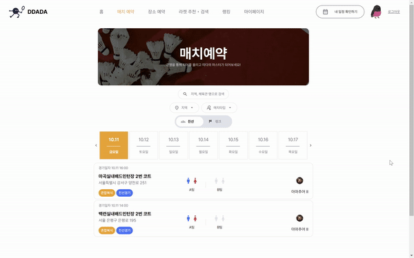
</details>

<details>
<summary>장소 예약 페이지</summary>
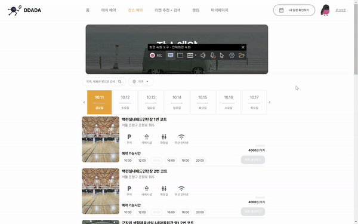
</details>

<details>
<summary>라켓 추천 • 검색 페이지</summary>

</details>

<details>
<summary>랭킹</summary>
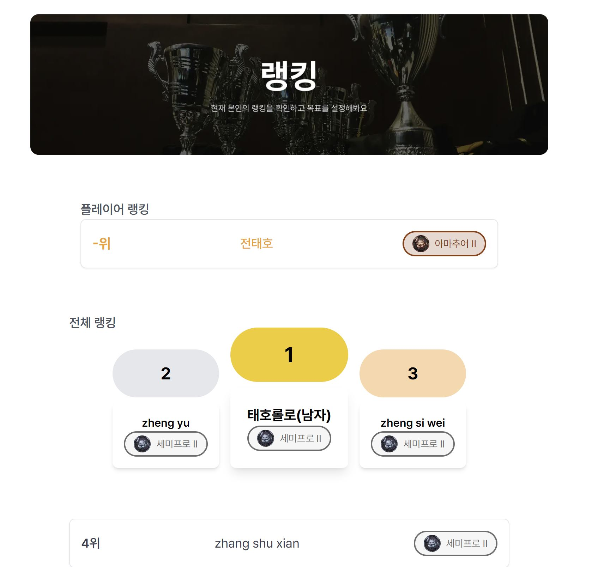
</details>

<details>
<summary>매니저 모집 페이지</summary>
<p>매니저 신청하기 버튼 클릭시 구글 폼으로 이동합니다.</p>

</details>

<details>
<summary>체육관 제휴 페이지</summary>
<p>체육관 제휴맺기 클릭 시 카카오 오픈채팅으로 연결됩니다.</p>

</details>

<details>
<summary>마이 페이지</summary>
  <details style="margin-left: 20px">
    <summary>내 프로필 수정</summary>
    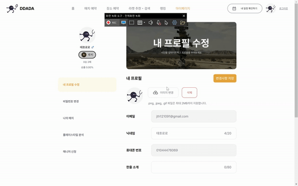
  </details>
  <details style="margin-left: 20px">
    <summary>비밀번호 변경</summary>
    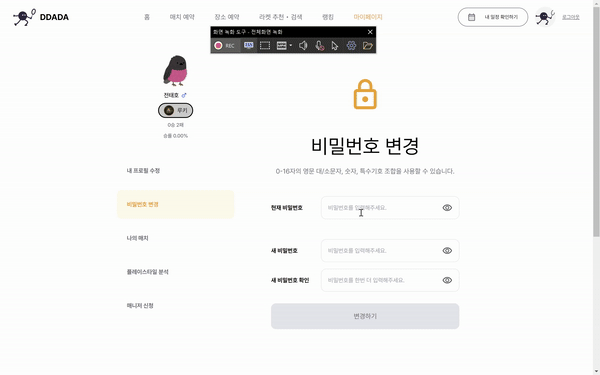
  </details>
  <details style="margin-left: 20px">
    <summary>나의 매치</summary>
    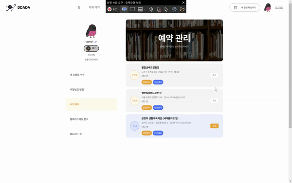
  </details>
   <details style="margin-left: 20px">
    <summary>플레이스타일 분석</summary>
    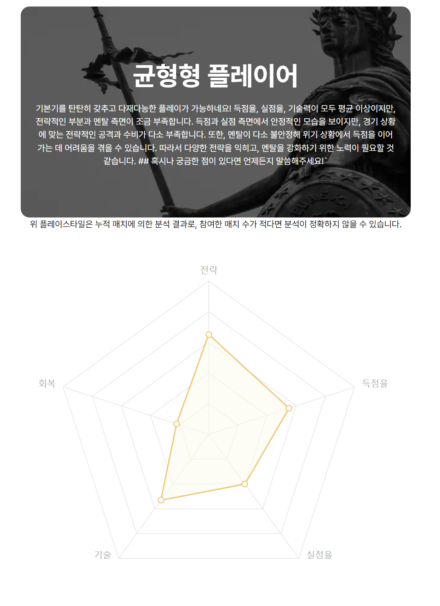
    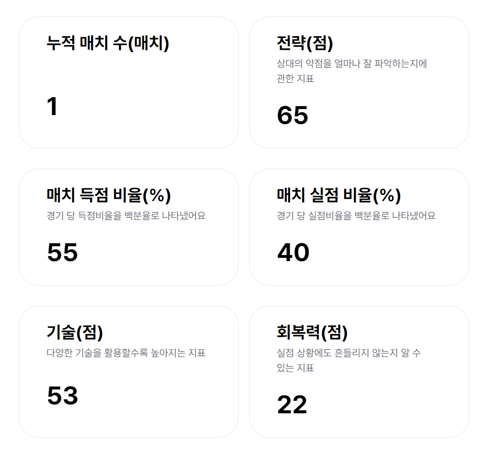
  </details>
</details>

### 3. 매니저

<details>
  <summary>매치 예약 페이지</summary>
  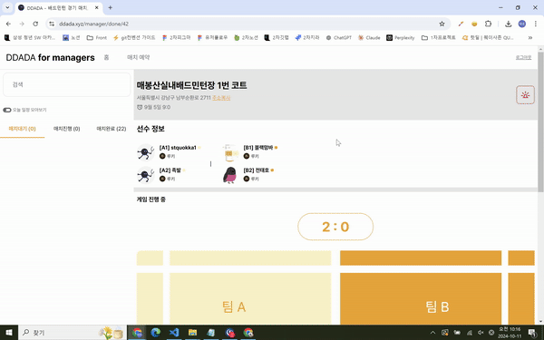
</details>

<details>
  <summary>매치 완료 페이지</summary>
  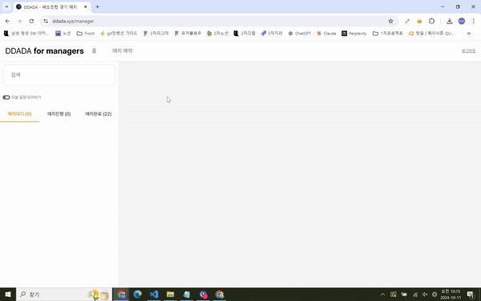
</details>

<details>
  <summary>매치 진행 페이지</summary>
  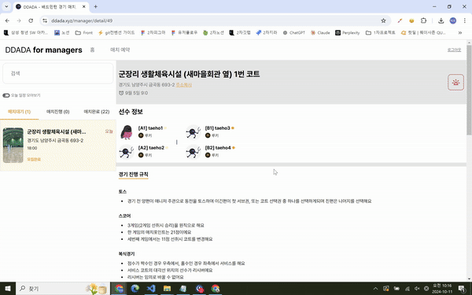
</details>

### 4. 체육관 관리자

<details>
<summary>대시보드 페이지</summary>

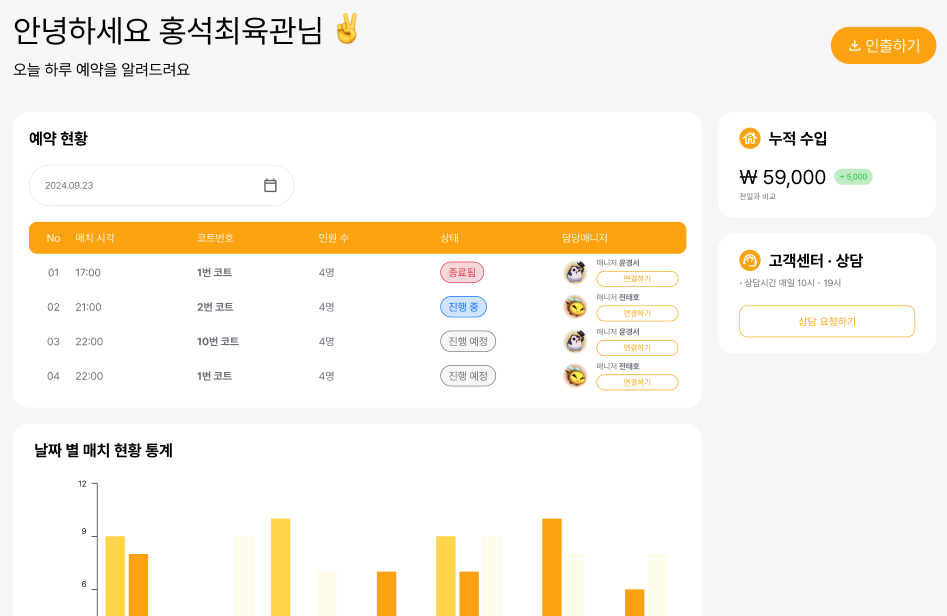
<p>대시보드 페이지</p>
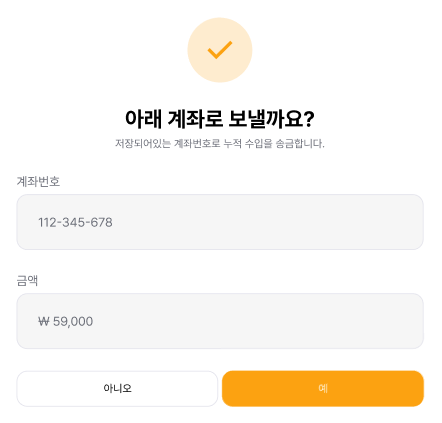 
<p>돈 인출 모달</p>
</details>

## ⚒️ **프로젝트 후기**

### 🍊박상우

기획부터 디자인까지 직접 전담해서 진행했던 프로젝트는 처음이었는데, 잘 분업되어 진행해준 팀원들 덕에 주차별로 문제 없이 기능 별 스프린트를 진행했던 것 같습니다.

아이디어 선정이 오래걸려 와이어프레임이 빈약했던 것이 아쉬웠습니다.
특히, 프론트 개발경험의 영향을 받아 figma의 auto layout을 공부하여 컴포넌트를 디자인, 배치한 것이 레이아웃 구현 시간을 크게 단축시켰습니다.

<br>
    
### 👻전태호
많은 것을 배울 수 있는 프로젝트였습니다. 곁에 든든한 프론트 팀원이 있다는게 정말 큰 힘이 되었습니다. 오직 개발에만 집중할 수 있도록 배려해준 팀원 덕분에 프론트 개발에서 제가 할 수 있는 최대한을 보여줄 수 있었던 것 같습니다.
이렇게 제대로 된 분업이 프로젝트는 처음이라 이 경험을 양식 삼아 더욱 성장해나가겠습니다.

<br>

### 😎최홍석

이번 프로젝트에서는 배드민턴 경기를 기록할 수 있는 인스턴스를 직접 만들었던 것이 기억에 남았습니다. Next도 처음 사용해 보았는데 SSR과 SSG등 차이점과 최적화하는 기법을 학습했습니다.

아쉬운점은 생각보다 프로젝트의 규모가 커져 모든 기능에 에러 핸들링을 하지 못한 점이었습니다. 또한 에러일 경우 페이지가 다운이 되지 않도록 렌더링이 되어야 하는데 안된 부분도 있어 아쉬웠습니다.
<br>

### 🐱‍🏍정한수

Spring Boot에서 JPA를 사용해 객체간 관계를 설계하는 과정에서 여러 시행착오를 겪으며 많은 것을 배웠습니다. 어노테이션을 이용해 객체 간 제약 조건을 설정하는 방법과 Record 클래스를 이용한 DTO, 각종 Exception Handling 및 디버깅을 위한 로깅 등 백엔드 개발자로써 많이 성장했다는 것이 느껴지는 프로젝트였습니다. 이전 프로젝트에서 사용한 인프라 지식을 활용해 프로젝트 초기부터 CI/CD를 구축해 프로젝트를 초기부터 원활하게 진행할 수 있었던 점과, PostgreSQL, Redis Clustering, ES 등 DB에 대한 도전이 성공적으로 끝마쳤다는 점도 뿌듯했습니다.

<br>

### 🏓최성철

공통 때 처음 사용하였던 스프링부트를 특화에서는 정확히 어떤 구조로 사용되는지 당연하게 사용했던 어노테이션들이 어떤 기능들을 가지고 있는지에 대하여 알아갈 수 있어서 유익한 프로젝트였습니다. 또한 레포지토리에서 쿼리를 직접 사용해보면서 SQL문에 대해서 알 수 있었고, 사용자 인증에만 사용하던 레디스를 다른 부분에서도 도입해보면서 자율에서 레디스를 어떻게 더 사용할 수 있을지 알아갔습니다.
<br>

### 🎯윤경서
데이터 방향성을 잡는 것이 오래걸려 아쉬웠습니다. 도메인에 대한 지식이 부족하여 사전 지식 학습 후 데이터 분석에 적용하는 과정에서 시간이 넉넉치 못해 다양하게 데이터를 뜯어보지 못한 것 같은 아쉬움이 있습니다. 그럼에도 배드민턴이 실력을 구분할 수 있는 지표가 명확하지 않아 이를 보여줄 수 있는 분석 결과를 주기 위해 다양한 방식으로 지표를 산정하고자 했던 것은 좋은 경험이었다고 생각합니다.
데이터 분석을 백엔드, 프론트엔드와 함께 실제 서비스로 연결하는 프로젝트는 이번이 처음이었는데 프로젝트 기한에 따라 데이터 탐색, 분석, 알고리즘 개발, 서비스 연결까지의 계획을 짜고 해당 일정을 명확히 관리하지 못해 데이터 부분의 서비스가 백엔드와 프론트엔드 진행단계에 비해 더뎠던 것 같습니다. 이를 기반으로 다음 프로젝트에 있어서는 계획을 조금 더 명확하게 기한을 정하고 이에 맞춰 데이터 분석을 진행해보려고 합니다. 또한, 백엔드와 데이터가 함께 DB를 쓰다보니 한쪽에서 문제가 생겼을 때 다른 쪽에서 진행이 원활히 되지 않아 진행이 지연된 부분이 있었습니다. 다음 프로젝트에서는 백엔드와 데이터의 DB를 분리해서 의존성을 낮추면 좋을 것 같습니다. 
CI/CD 부분을 배웠던 점도 좋았습니다. 데이터 서버의 CI/CD를 맡아 인프라 부분을 담당한 팀원에게 배우고, 도움을 받아 직접 파이프라인을 작성해 배포해볼 수 있어서 유익했습니다.
프론트와 백엔드, 디자인 및 기획, 데이터로 이루어진 명확한 역할 분담으로 데이터 파트만을 온전히 담당해 수집한 데이터에 집중할 수 있었던 점은 좋았습니다. 또한, 팀원간의 원활한 소통으로 문제가 발생했을 때나 디벨롭 사항이 생겼을 때 바로바로 해결이 되었던 점이 좋았습니다. 다음 프로젝트에서는 이번 프로젝트의 아쉬움을 보완할 수 있는 프로젝트가 될 수 있도록 노력하겠습니다.
<br>
